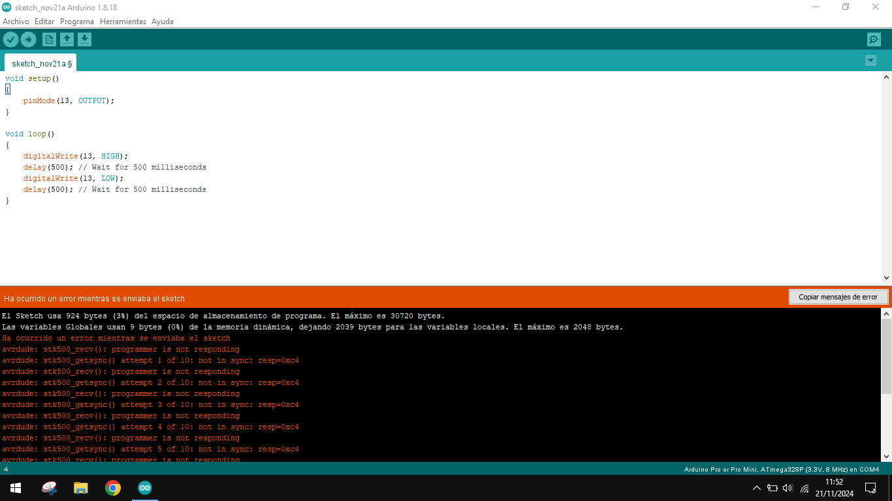

# Arduino IDE
[https://www.arduino.cc/en/software](https://www.arduino.cc/en/software)

# Arduino Pro Mini
- USB TTL driver CH34X: [https://sparks.gogo.co.nz/ch340.html?srsltid=AfmBOoq7jO5QAdNa4s2f7-l9HeBqC0kql-rBiOcXg6ZbXtubFZbH1mm4](https://sparks.gogo.co.nz/ch340.html?srsltid=AfmBOoq7jO5QAdNa4s2f7-l9HeBqC0kql-rBiOcXg6ZbXtubFZbH1mm4)

# ESP32
- Download module esp32 in Arduino IDE
- Drivers esp32 by model: [https://www.pololu.com/docs/0j7/all](https://www.pololu.com/docs/0j7/all)
- Tools -> board -> esp32 -> esp32 Dev Module -> Port COMX
- Files -> Examples -> WiFi -> WiFiScan

ESP32
[https://www.youtube.com/watch?v=BQBFJ8qc3z4&list=PLirOJo-HO7RyJF5EvjP3r9Z4mwQG8G94B](https://www.youtube.com/watch?v=BQBFJ8qc3z4&list=PLirOJo-HO7RyJF5EvjP3r9Z4mwQG8G94B)

Sensor DHT11
[https://www.youtube.com/watch?v=5rJnV9XyoJQ&list=PLirOJo-HO7RyJF5EvjP3r9Z4mwQG8G94B&index=2](https://www.youtube.com/watch?v=5rJnV9XyoJQ&list=PLirOJo-HO7RyJF5EvjP3r9Z4mwQG8G94B&index=2)

SENSOR GAS BUTANO
[https://www.youtube.com/watch?v=xBMReV63d0Q&list=PLirOJo-HO7RyJF5EvjP3r9Z4mwQG8G94B&index=3](https://www.youtube.com/watch?v=xBMReV63d0Q&list=PLirOJo-HO7RyJF5EvjP3r9Z4mwQG8G94B&index=3)

GPS NEOO 6M
[https://www.youtube.com/watch?v=ncNTirLaWao&list=PLirOJo-HO7RyJF5EvjP3r9Z4mwQG8G94B&index=4](https://www.youtube.com/watch?v=ncNTirLaWao&list=PLirOJo-HO7RyJF5EvjP3r9Z4mwQG8G94B&index=4)

